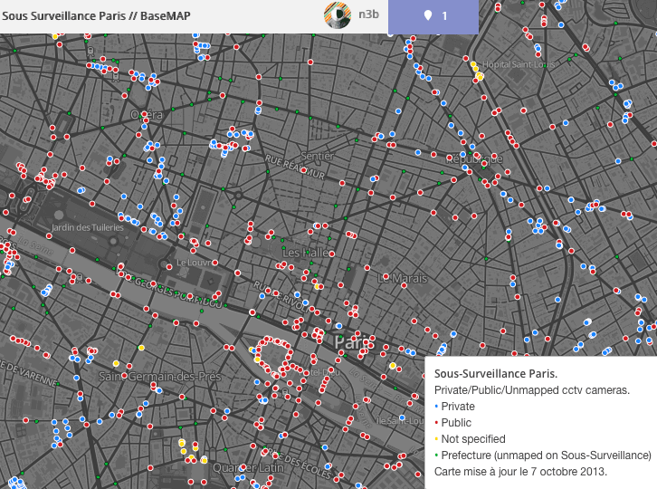

# Sous-Surveillance Paris on TileMill

This map use the data of :

* [The projet sous-surveillance.net](http://www.sous-surveillance.net/?page=cameras&format=json) who is a crowdsourced cctv cam map.
* OSM for the streets, water and natural spaces from [Geofrabrik](http://download.geofabrik.de/europe/france.html).
* [Data.gouv.fr](http://www.data.gouv.fr/DataSet/551635); shapefile with the position of cops CCTV.

### Screenshot

### Use this map

[The project online](http://support.mapbox.com/discussions/tilemill/6675/r?go=aHR0cDovL2EudGlsZXMubWFwYm94LmNvbS92My9uM2IuU291cy1TdXJ2ZWlsbGFuY2VfUGFyaXNfUHJpdmF0ZS1QdWJsaWMvcGFnZS5odG1s)

### Get the files

Click on [this adress](http://www.mapbox.com/tilemill/) to download TileMill, and download the files from here (zip or `git clone https://github.com/N3bTcx/TileMill_SousSurveillance.git` in `Mapbox\Projets\`). 

### Discussion on the map

Check the discussion and feedbacks on the support forum of MapBox : [Feedbacks needed for my first map](http://support.mapbox.com/discussions/tilemill/6675-feedbacks-needed-for-my-first-map)

### To Do

* Add a real OSM background with buildings and streets
* Add the number of cam threw each areas of Paris (the layer is already added)
* Add the potential views of each cams (CCTV Bank, main cops cctv)
* Manage layers (private, public)
* Add color gradient to see the % of cams per meter.
    
### License
Public Domain. I don't care. Have fun and fuck CCTV. 

### Contact
Ping me on IRC `irc.indymedia.org` `#sous-surveillance`. Nickname `n3b`